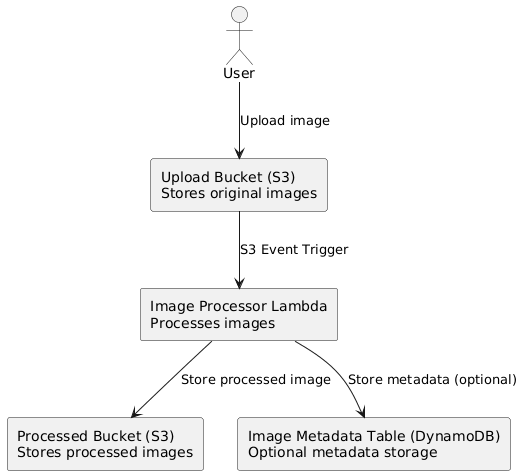

# Serverless Image Processing on AWS

## Project Description
This project implements a serverless image processing application using AWS Lambda and S3. Users upload images to the Upload Bucket, which triggers a Lambda function that processes and stores images in the Processed Bucket. Optionally, metadata is stored in DynamoDB.

## Architecture

## Folder Structure

src/ # Lambda function source code
templates/ # CloudFormation templates
README.md # Project documentation
architecture-diagram.png # Visual architecture diagram

## AWS Services Used
- Amazon S3 (Upload & Processed Buckets)
- AWS Lambda (Image processing)
- Amazon DynamoDB (Optional metadata storage)

## Usage
1. Upload an image to the Upload Bucket.
2. Lambda automatically processes the image and stores it in the Processed Bucket.
3. Metadata stored in DynamoDB (optional).
